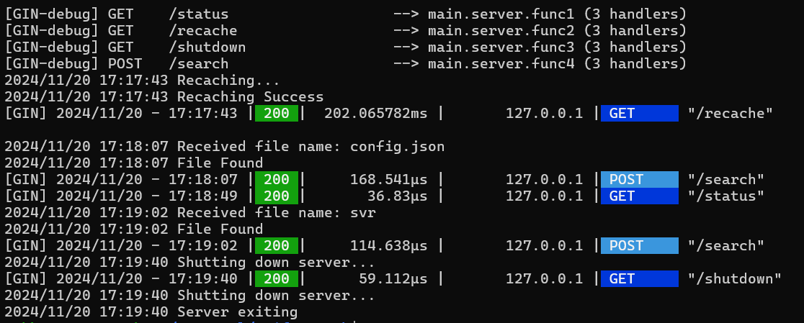
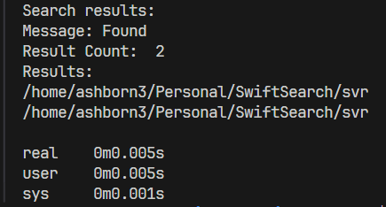

# SwiftSearch

## Introduction
SwiftSearch is a robust and efficient tool designed to enhance file searching operations. Leveraging the power of Go, SwiftSearch aims to deliver fast and accurate search results, streamlining the file lookup process in large directories or complex data structures.

## Keypoints
- **Asynchronous Indexing**
- **Mutex Synchronization**
- **Cache Encryption**
- **Client-Server Setup**
- **Customizable**

## Benchmark Results

- **Test Environment**: 
  - CPU: AMD Ryzen 7 5800H
  - RAM: 16GB
  - Storage: NVMe SSD

- **Performance Metrics**:
  - **File Search (Server)**: 100us to 200us (This includes time taken by the server from looking up the file to sending back the response)
  - **File Search (Client)**: <200ms (This includes time taken from client binary execution starting to writing the formatted result to standard output)
  - **Cache Building**: ~200ms

## Server Log with Timings


## Client Output with Timings using 'time'



## Setup Instructions
1. **Clone the repository**:
   ```bash
   git clone https://github.com/ashborn3/SwiftSearch.git
   cd SwiftSearch
   ```

2. **Install dependencies**:
   Ensure Go is installed on your system (Go 1.16+ recommended).
   ```bash
   go mod tidy
   ```

3. **Build the application**:
   ```bash
   go build -o <svr> ./server/
   go build -o <clt> ./client/
   ```

4. **Setup the config.json file**:
   ```json
   {
      "homePath" : "<Root dir of cache>",
      "cachePath": "<somewhere>/cache.gob",
      "encryptionKey": "a very very very very secret key",
      "ip": "localhost",
      "port": 6969,
      "syncTime": 1
   }
   ```

5. **Run the application**:
   ```bash
   ./<svr>
   ./<clt> <command> <argument>
   ```

## Usage of client

1. **Search**: ./<clt> search <filename>
2. **Rebuild Cache**: ./<clt> recache
3. **Status of Server**: ./<clt> status
4. **💀KILL💀**: ./<clt> kill